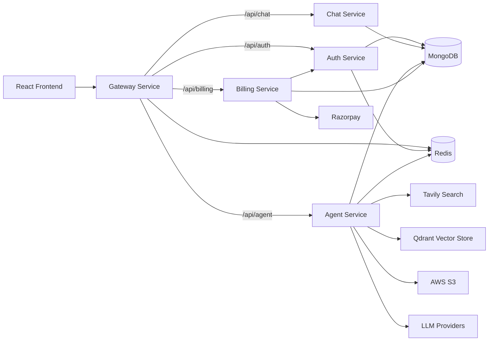

# NexaAI

CortexAI is a full-stack multi-agent AI workspace with a React frontend and a Node.js microservice backend.

It supports:
- Google login (Firebase)
- Multi-conversation chat history
- Agent routing (chat, coding, search, pdf, ppt, vision)
- PDF/image upload workflows
- Artifact preview for generated code (Monaco + live iframe)
- Credit-based billing with Razorpay

## Repository Structure

```text
CortexAI/
├── frontend/                    # React + Vite client
├── backend/
│   ├── gateway/                 # API gateway + auth middleware + proxy
│   ├── services/
│   │   ├── auth/                # Login/session + user credits
│   │   ├── chat/                # Conversations + messages
│   │   ├── agent/               # LangGraph orchestration + AI agents
│   │   └── billing/             # Razorpay order/payment verification
│   ├── shared/redis/            # Shared Redis client
│   └── docker-compose.yml       # Redis container
└── README.md
```

## High-Level Architecture



## Backend Services

### 1) Gateway (`backend/gateway`)
- Entry point for frontend API traffic.
- Uses `cookie-parser`, `cors`, `morgan`, and `express-http-proxy`.
- Routes:
  - `/api/auth` -> Auth service
  - `/api/chat` -> Chat service (protected)
  - `/api/agent` -> Agent service (protected)
  - `/api/billing` -> Billing service (protected)
  - `/api/me` -> returns user from session (protected)
- Protection middleware reads `session` cookie, resolves `session-<id>` from Redis, and injects `req.user`.
- For protected proxy calls, forwards `x-user-id` header to downstream services.

### 2) Auth (`backend/services/auth`)
- Verifies Firebase ID token (`firebase-admin`).
- Creates/loads user in MongoDB.
- Creates Redis-backed session and sets `session` cookie.
- Maintains plan + credits.
- Endpoints:
  - `POST /login`
  - `GET /logout`
  - `POST /update-plan`
  - `POST /deduct-credits`

### 3) Chat (`backend/services/chat`)
- Stores conversations and messages in MongoDB.
- Endpoints:
  - `GET /create-conversation`
  - `GET /get-conversations`
  - `POST /update-conversation`
  - `POST /save-message`
  - `GET /get-messages/:conversationId`

### 4) Agent (`backend/services/agent`)
- Runs LangGraph state machine.
- Main endpoint: `POST /chat` (`multer.single("file")`)
- Supported upload types: PDF and images (max 20MB).

#### LangGraph nodes
- `router`
- `chat`
- `search`
- `coding`
- `pdf`
- `ppt`
- `vision`
- `pdfRag`
- `imageAnalyzer`

Routing behavior:
- If explicit agent is passed (not `auto`), it is used.
- If file is PDF -> `pdfRag`.
- If file is image -> `imageAnalyzer`.
- Otherwise router LLM classifies prompt.

Special edge:
- `search -> chat` so search results are passed into chat response synthesis.

Other flows in Agent service:
- Loads/stores short conversation memory in Redis (`messages-<conversationId>`).
- Persists user + assistant messages via Chat service API.
- Deducts credits through Auth service.

### 5) Billing (`backend/services/billing`)
- Creates Razorpay orders for plan upgrades.
- Verifies payment signature.
- Stores payment record in MongoDB.
- Calls Auth service `/update-plan` after successful payment.
- Endpoints:
  - `POST /create`
  - `POST /verify`

## Frontend Architecture (`frontend`)

- React 19 + Vite + Tailwind CSS v4.
- Global state via Redux Toolkit slices:
  - `userSlice`
  - `conversationSlice`
  - `messageSlice`
- Main layout:
  - `SideBar` (sessions, profile, billing)
  - `ChatArea` (header, messages, input)
  - `Artifact` panel (Monaco + preview iframe)

### Frontend workflow summary
1. On app load, calls `/api/me` to restore logged-in session.
2. If no user, shows Google login overlay.
3. Creates/selects conversation.
4. Sends prompt (and optional file) to `/api/agent/chat`.
5. Renders assistant response, images, and artifacts.
6. Artifact panel previews generated code (`index.html`, `style.css`, `script.js`) with responsive viewport modes.

## End-to-End Workflow

### A) Authentication
1. User signs in with Google in frontend.
2. Frontend sends Firebase token to `POST /api/auth/login`.
3. Auth service verifies token, upserts user, creates Redis session, sets cookie.
4. Gateway uses cookie for protected routes and `/api/me`.

### B) Chat + Agent execution
1. Frontend creates or selects a conversation.
2. Frontend sends `prompt`, `conversationId`, `agent`, and optional `file`.
3. Agent service stores user message.
4. LangGraph routes to correct agent.
5. Agent executes tools/models (search, generation, RAG, image, etc.).
6. Credits are deducted.
7. Agent stores assistant message.
8. Response returns to frontend.

### C) Billing
1. Frontend opens billing drawer and selects plan.
2. `POST /api/billing/create` creates Razorpay order.
3. Razorpay checkout completes and returns payment details.
4. Frontend calls `POST /api/billing/verify`.
5. Billing verifies signature, marks payment paid, calls Auth service `/update-plan`.
6. User plan and credits are updated.

## Credits and Rate Limits

Credit deduction (`auth.controller.js`):
- `chat`: 1
- `search`: 5
- `coding`: 10
- `pdf`: 10
- `ppt`: 10
- `vision`: 10

Rate limits (per user/agent, 60s Redis window, `agentLimit.js`):
- `chat`: 20
- `coding`: 5
- `pdf`: 5
- `ppt`: 5
- `image`: 5
- `search`: 5

## Environment Variables

Create `.env` files for each service (`gateway`, `services/auth`, `services/chat`, `services/agent`, `services/billing`) and for `frontend/.env`.

### Gateway
- `PORT`
- `FRONTEND_URL`
- `AUTH_SERVICE`
- `CHAT_SERVICE`
- `AGENT_SERVICE`
- `BILLING_SERVICE`
- `REDIS_URL`

### Auth
- `PORT`
- `MONGODB_URI`
- `REDIS_URL`
- Firebase Admin credentials file at `backend/services/auth/serviceAccountKey.json`

### Chat
- `PORT`
- `MONGODB_URI`

### Agent
- `PORT`
- `MONGODB_URI`
- `CHAT_SERVICE`
- `AUTH_SERVICE`
- `QDRANT_URL`
- `TAVILY_API_KEY`
- `GOOGLE_API_KEY`
- `GROQ_API_KEY`
- `OPENROUTER_API_KEY`
- `AWS_REGION`
- `AWS_ACCESS_KEY_ID`
- `AWS_SECRET_KEY`
- `AWS_BUCKET_NAME`

### Billing
- `PORT`
- `MONGODB_URI`
- `AUTH_SERVICE`
- `RAZORPAY_KEY_ID`
- `RAZORPAY_KEY_SECRET`

### Frontend (`frontend/.env`)
- `VITE_SERVER_URL`
- `VITE_FIREBASE_API_KEY`
- `VITE_RAZORPAY_KEY_ID`

## Local Development

### 1) Start Redis
From `backend/`:

```bash
docker compose up -d
```

### 2) Install dependencies

```bash
# frontend
cd frontend
npm install

# backend services
cd ../backend/gateway && npm install
cd ../services/auth && npm install
cd ../chat && npm install
cd ../agent && npm install
cd ../billing && npm install
```

### 3) Run services (separate terminals)

```bash
# gateway
cd backend/gateway && npm run dev

# auth
cd backend/services/auth && npm run dev

# chat
cd backend/services/chat && npm run dev

# agent
cd backend/services/agent && npm run dev

# billing
cd backend/services/billing && npm run dev

# frontend
cd frontend && npm run dev
```

## Notes

- `backend/services/auth/serviceAccountKey.json` should be treated as sensitive and should not be committed with real credentials.
- Temporary uploads in Agent service are stored in `backend/services/agent/temp` and deleted after processing for PDF/image analysis flows.
